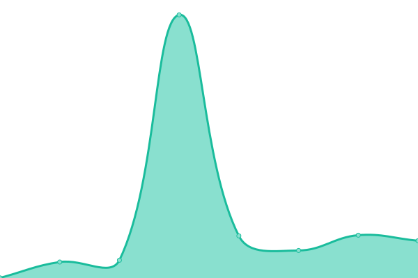

# [📈 实时状态](https://status.nya.one): <!--live status--> **所有系统正常运行**

This repository contains the open-source uptime monitor and status page for [NyaOne 喵窝](https://nya.one), powered by [Upptime](https://github.com/upptime/upptime).

With [Upptime](https://upptime.js.org), you can get your own unlimited and free uptime monitor and status page, powered entirely by a GitHub repository. We use [Issues](https://github.com/nyaone/remote-status-monitor/issues) as incident reports, [Actions](https://github.com/nyaone/remote-status-monitor/actions) as uptime monitors, and [Pages](https://status.nya.one) for the status page.

## [📈 Live Status](https://demo.upptime.js.org): <!--live status--> **所有系统正常运行**

<!--start: status pages-->
<!-- This summary is generated by Upptime (https://github.com/upptime/upptime) -->
<!-- Do not edit this manually, your changes will be overwritten -->
<!-- prettier-ignore -->
| URL | Status | History | Response Time | Uptime |
| --- | ------ | ------- | ------------- | ------ |
|  [Misskey](https://nya.one) | 在线 | [misskey.yml](https://github.com/nyaone/remote-status-monitor/commits/HEAD/history/misskey.yml) | 

 367毫秒
     
 | 

<a href="https://status.nya.one/history/misskey">100.00%</a>
    

|  [Matrix](https://matrix.nya.one/_matrix/client/versions) | 在线 | [matrix.yml](https://github.com/nyaone/remote-status-monitor/commits/HEAD/history/matrix.yml) | 

 295毫秒
     
 | 

<a href="https://status.nya.one/history/matrix">100.00%</a>
    

|  [文件存储](https://sh.nfs.pub/nyaone/ff02042e-524e-48e8-bb27-17621d96b13a.png) | 在线 | [.yml](https://github.com/nyaone/remote-status-monitor/commits/HEAD/history/.yml) | 

 335毫秒
     
 | 

<a href="https://status.nya.one/history/">100.00%</a>
    

|  [搜索引擎](https://meilisearch.nya.one) | 在线 | [.yml](https://github.com/nyaone/remote-status-monitor/commits/HEAD/history/.yml) | 

 335毫秒
     
 | 

<a href="https://status.nya.one/history/">100.00%</a>
    

|  [媒体代理](https://o.n1mp.org) | 在线 | [.yml](https://github.com/nyaone/remote-status-monitor/commits/HEAD/history/.yml) | 

 335毫秒
     
 | 

<a href="https://status.nya.one/history/">100.00%</a>
    

|  [喵家中继](https://relay.nya.one/actor) | 在线 | [.yml](https://github.com/nyaone/remote-status-monitor/commits/HEAD/history/.yml) | 

 335毫秒
     
 | 

<a href="https://status.nya.one/history/">100.00%</a>
    

|  [邮件系统](7302d3bb.ovh.node.public.nyawork.net) | 在线 | [.yml](https://github.com/nyaone/remote-status-monitor/commits/HEAD/history/.yml) | 

 335毫秒
     
 | 

<a href="https://status.nya.one/history/">100.00%</a>
    

|  [API Wrap](https://api.nya.one) | 在线 | [api-wrap.yml](https://github.com/nyaone/remote-status-monitor/commits/HEAD/history/api-wrap.yml) | 

 281毫秒
     
 | 

<a href="https://status.nya.one/history/api-wrap">100.00%</a>
    

|  [备用域名](https://n1.homes) | 在线 | [.yml](https://github.com/nyaone/remote-status-monitor/commits/HEAD/history/.yml) | 

 335毫秒
     
 | 

<a href="https://status.nya.one/history/">100.00%</a>
    

|  [Misskey (开发环境)](https://dev.nya.one) | 在线 | [misskey.yml](https://github.com/nyaone/remote-status-monitor/commits/HEAD/history/misskey.yml) | 

 367毫秒
     
 | 

<a href="https://status.nya.one/history/misskey">100.00%</a>
    

|  [Matrix (开发环境)](https://dev-matrix.nya.one/_matrix/client/versions) | 在线 | [matrix.yml](https://github.com/nyaone/remote-status-monitor/commits/HEAD/history/matrix.yml) | 

 295毫秒
     
 | 

<a href="https://status.nya.one/history/matrix">100.00%</a>
    

|  [API Wrap (开发环境)](https://dev-api.nya.one) | 在线 | [api-wrap.yml](https://github.com/nyaone/remote-status-monitor/commits/HEAD/history/api-wrap.yml) | 

 281毫秒
     
 | 

<a href="https://status.nya.one/history/api-wrap">100.00%</a>
    

<!--end: status pages-->

[**Visit our status website →**](https://status.nya.one)

## 📄 License

- Powered by: [Upptime](https://github.com/upptime/upptime)
- Code: [MIT](./LICENSE) © [Anand Chowdhary](https://anandchowdhary.com), supported by [Pabio](https://pabio.com)
- Data in the `./history` directory: [Open Database License](https://opendatacommons.org/licenses/odbl/1-0/)
